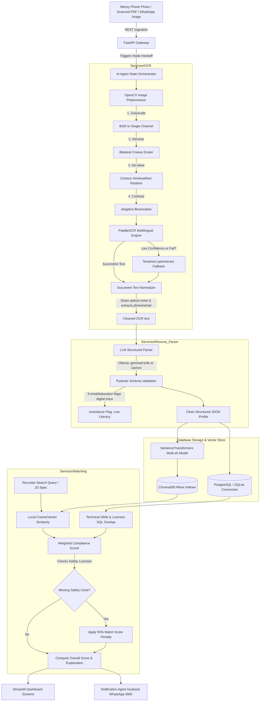
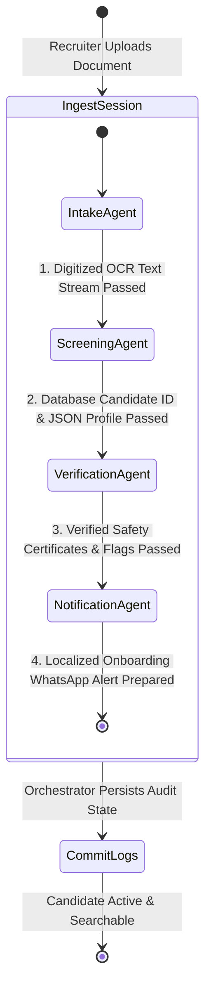

# 🛠️ Kshamata: Industrial Workforce Recruitment & Intelligence Platform
## Complete Architectural Blueprint & Recruiter Manual

Welcome to the Kshamata ("Capability/Skill" in Hindi) enterprise-grade documentation manual. This guide is written for solutions architects, system administrators, and recruitment operators. It maps out Kshamata's dual-OCR models, local LLM integrations, compliance matching metrics, and provides a step-by-step user guide for each interactive dashboard screen.

---

## 🎨 1. Platform Design Blueprint

Below is the conceptual blueprint of the **Kshamata Recruiter Command Center**, showcasing active applicant flows, candidate source breakdowns, and AI candidate scoring matrix modules:


---

## 🏗️ 2. Platform Architecture & Data Flow

Kshamata converts noisy physical document inputs into validated digital hires. The system diagram below illustrates the path an uploaded resume takes, from a smartphone camera photo all the way to localized SMS dispatch:

### 2.1 End-to-End System Data Flow



---

## 🤖 3. AI Event-Driven State Agents Blueprint

Kshamata coordinates five specialized AI Agents. Every uploaded resume compiles a localized `AgentState` object which is systematically updated by the orchestrator:



### 3.1 Agents Breakdown
1.  **Intake Agent (`services/agents/intake.py`):** Runs the OpenCV image filters and coordinates the PaddleOCR/Tesseract dual engines.
2.  **Screening Agent (`services/agents/screening.py`):** Passes OCR text to Gemini/Ollama. It executes a **safe candidate override**: if a candidate's email is already registered, it avoids a SQL `IntegrityError` by updating their existing profile and wiping old certifications instead of crashing!
3.  **Verification Agent (`services/agents/verification.py`):** Audits safety licenses. It flags experience/age anomalies (e.g. 15 years experience at age 19) or missing contact data.
4.  **Notification Agent (`services/agents/notification.py`):** Automatically detects candidate languages (e.g. Hindi, Spanish, English) and drafts WhatsApp templates in their native tongue.
5.  **Agent Orchestrator (`services/agents/orchestrator.py`):** Sequences executions, captures errors, and writes log snapshots into the `agent_logs` and `audit_logs` DB tables.

---

## 🔒 4. Compliance-First Match Ranking Logic

Blue-collar safety recruitment cannot rely solely on semantic searches (which might recommend an unlicensed crane operator just because they have a high similarity score). Kshamata implements a **weighted compliance score matrix (0-100)**:

$$\text{Overall Score} = (\text{Vector Similarity} \times 40) + (\text{Skills Overlap} \times 30) + (\text{License Overlap} \times 30)$$

### 4.1 Score-Based Hiring Status Matrix
Once the matching engine computes the overall score, it categorizes candidates:
*   **PASSED (Score $\ge 80\%$):** Displayed as a **Forest Green Badge**. Highly qualified and safe to schedule.
*   **MAY HIRE (Score $60\%$ to $80\%$):** Displayed as a **Safety Gold Badge**. Partially qualified; requires human review of missing minor skills.
*   **FAILED (Score $< 60\%$):** Displayed as a **Danger Red Badge**. Unsuited or compliance-rejected.

### 4.2 The 50% Compliance Penalty
If a Job Description lists mandatory safety certifications (e.g., *Boiler Attendant Grade-1, DGMS Mining Sirdar*) and the candidate has **zero matches** on those licenses, Kshamata automatically triggers a safety lockout:
*   **Penalty Action:** The candidate's overall matching score is cut in half ($\times 0.5$).
*   **Status Impact:** This automatically drops their status to **FAILED**, and a bold warning badge is rendered: `⚠️ 50% SAFETY COMPLIANCE PENALTY APPLIED`.

---

## 🖥️ 5. Streamlit Recruiter Manual (Screen-by-Screen)

Kshamata features a curated, dark-mode glassmorphic user interface. Let's walk through how to navigate and use each screen:

### Page 1: Home Dashboard Portal (`ui/app.py`)
*   **What it does:** Displays global metrics (digitized candidates, photo files uploaded, low-literacy ratios, and certification verification rates) alongside active environment properties.
*   **How to use it:** 
    *   Open Kshamata to see the live metrics grid.
    *   Read the **Active Environment Stats** pane to see whether you are connected to `PostgreSQL` or `SQLite Fallback`, and what local LLM model is active.

### Page 2: Analytics Center (`ui/pages/1_Dashboard.py`)
*   **What it does:** Renders Plotly pie charts and bar charts displaying candidate literacy splits, industry domain shares, and registers administrative action logs.
*   **How to use it:**
    *   Inspect the **Literacy & Onboarding Assistance** pie chart to see how many workers were flagged with the `Low Literacy flag` (representing candidates with no email or limited school trace who need phone-call onboarding help).
    *   Review the **Workforce Industry Domain** bar chart to inspect domain shares (Mining vs Steel vs Thermal).
    *   Scroll to the **Audit Trail** table to see structural actions (e.g. agent runs, JDs seeded) with timestamps.

### Page 3: Resume Ingestion Portal (`ui/pages/2_Resume_Ingestion.py`)
*   **What it does:** The main digitization intake screen where contractors drag-and-drop worker hardcopy resumes.
*   **How to use it:**
    *   Click **"Browse files"** or drag and drop a PDF or PNG/JPG image (like a cell phone photo of a paper resume).
    *   Click **"🚀 Run AI Recruiting Agents Ingestion"**.
    *   Watch the spinner while the agents clean the image, run OCR, parse structured attributes, audit licenses, and prepare WhatsApp templates.
    *   Review the **Ingestion Results columns**:
        *   *Left Column (Extract):* Cleaned profile attributes (skills, mechanical equipment operated, location, experience).
        *   *Middle Column (Auditing):* OCR confidence metrics, verified safety licenses list, and red anomaly flags.
        *   *Right Column (WhatsApp):* A ready-to-copy WhatsApp message drafted in their native script (Hindi, Spanish, etc.).
    *   Review **🎯 Targeted Job Openings Recommendations** at the bottom: This automatically ranks all job listings in your database against this newly ingested candidate, displaying their fit score and compliance status tags (Passed, May Hire, Failed).

### Page 4: Conversational Semantic Search (`ui/pages/3_Semantic_Search.py`)
*   **What it does:** Allows recruiters to search for candidates using natural conversational sentences instead of rigid keywords.
*   **How to use it:**
    *   Type a prompt into the query bar (e.g., `"Find welders with thermal plant experience and safety certification"`).
    *   Press Enter.
    *   Inspect matching profiles, similarity percentages, contact phone numbers, and technical skills listed in a glassmorphic column list.

### Page 5: Compliance & Job Matching (`ui/pages/4_Job_Matching.py`)
*   **What it does:** The center for matching vacancies and candidates. It includes a JD selector dropdown and a dynamic JD creation sidebar.
*   **How to use it:**
    *   **Register a new Job Opening:** In the left sidebar, fill in the *Job Title, Description, Required Skills, Mandatory Licenses (comma separated)*, and click **📁 Register JD**.
    *   **Rank Candidates:** Select the Job Description from the dropdown menu.
    *   Review the ranked scorecards:
        *   Candidates are ordered descending by overall match score.
        *   Each card header exhibits their ranked number, name, and glowing green/gold/red status badge (**PASSED**, **MAY HIRE**, **FAILED**).
        *   Review the score breakdowns (Vector Score, Skills Score, Safety Score) and matched vs missing skills/certificates.
        *   Read the **AI Matching Auditor Remark** italicized box at the bottom of the card for a comprehensive explanation.

### Page 6: AI Agent Flow Monitor (`ui/pages/5_Agent_Monitor.py`)
*   **What it does:** A real-time debugging and auditing interface to inspect the AI agent crew's execution traces.
*   **How to use it:**
    *   Select an active **AI Ingestion Run Session ID** from the dropdown menu.
    *   Review the vertical step-by-step pipeline cards showing step messages and timestamps.
    *   Expand the **JSON State variables snapshot** drawer on any card to view the exact values of the state variables (OCR inputs, parsed attributes, validation statuses) logged by the agent orchestrator at that step.

---

## 🏃 6. Local Operations & Config Guide

Here are the commands to initialize, run, and customize the platform locally:

### 6.1 Database Schema Initialization
If you want to clear your local fallback database or initialize Postgres tables, run the schema builder:
```bash
python3 scripts/init_db.py
```

### 6.2 Data Seeding & Simulation Test
Populate the database with seeded vacancies (Boiler Attendant, Mining Sirdar, Structural Welder) and run a simulated ingestion run:
```bash
python3 scripts/seed_data.py
```

### 6.3 Start Streamlit (Local Developer Mode)
```bash
streamlit run ui/app.py
```

### 6.4 Start FastAPI server (CORS-ready REST API)
```bash
uvicorn api.main:app --reload --port 8000
```
Open `http://localhost:8000/docs` in your browser to view the interactive Swagger interface.

### 6.5 Deploy Production Containers
```bash
docker-compose up --build
```
This builds and launches three isolated services: `db` (Postgres on 5432), `api` (FastAPI on 8000), and `ui` (Streamlit on 8501) with local persistence volumes.
